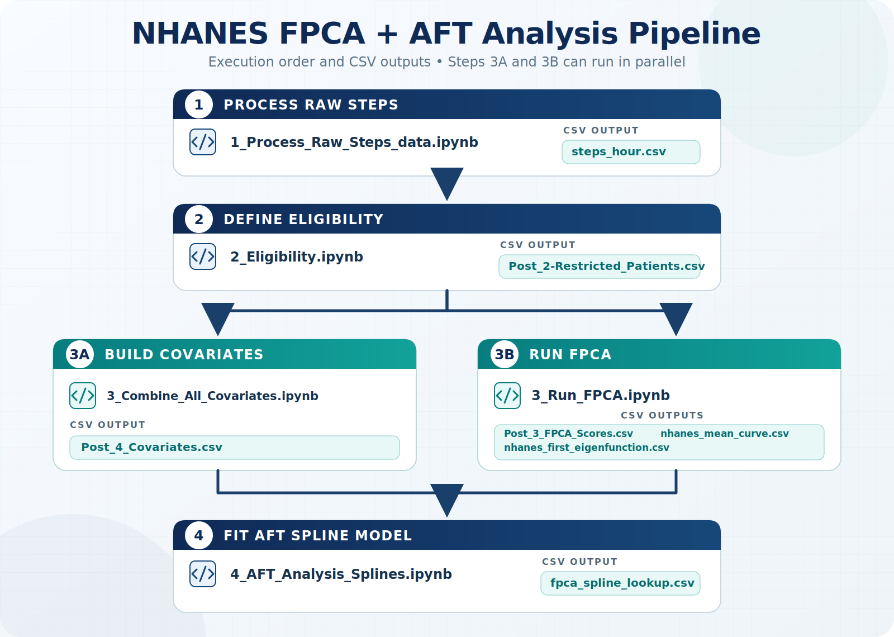

# NHANES FPCA AFT Pipeline

Reproducible analysis notebooks for processing NHANES accelerometry data, deriving functional principal component analysis (FPCA) scores, and fitting accelerated failure time (AFT) survival models.



## Included workflow

Run the notebooks in this dependency order:

1. `1_Process_Raw_Steps_data.ipynb` converts minute-level step records to hourly steps and applies wear-time checks.
2. `2_Eligibility.ipynb` builds the mortality-eligible analytic cohort.
3. Run `3_Combine_All_Covariates.ipynb` and `3_Run_FPCA.ipynb`. These notebooks depend on step 2 but not on each other, so they may run in parallel.
4. `4_AFT_Analysis_Splines.ipynb` joins the covariates and FPCA scores, then fits Kaplan-Meier and Weibull AFT models with splines.

The repository includes the supplied intermediate tables and model artifacts (`steps_hour.csv`, `Post_*` CSVs, the mean curve, eigenfunction, spline lookup, and baseline survival) so the later analysis stages can be inspected without rerunning the raw-data preparation.

## Related project

This research pipeline is directly related to [resace3/FPCA_AFT_Health_Addon](https://github.com/resace3/FPCA_AFT_Health_Addon), the downstream Home Assistant add-on that uses the generated `nhanes_mean_curve.csv`, `nhanes_first_eigenfunction.csv`, and `fpca_spline_lookup.csv` artifacts.

## Environment

The notebooks were authored for Google Colab and use Python only to enable the `rpy2` R magic. They require an R runtime and the R packages used in the notebooks, including:

`data.table`, `dplyr`, `readr`, `ggplot2`, `nhanesA`, `fdapace`, `survival`, `splines`, and `rstpm2`.

Several notebook cells mount Google Drive and refer to `/content/drive/MyDrive/masters_thesis/NHANES-2-Cleaner/`. When running outside the original Colab setup, update those paths to this repository's local directory or place the repository at the same Drive location.

## Data provenance

The analysis uses public NHANES 2011–2012 and 2013–2014 data, together with the linked mortality files fetched in the notebooks from CDC endpoints. The minute-level source file referenced by the first notebook (`nhanes_1440_vssteps.csv`) is not included; the supplied hourly derivative is included as `steps_hour.csv`.

NHANES data use is subject to the applicable [CDC/NCHS data terms](https://www.cdc.gov/nchs/nhanes/index.html). This repository is a research workflow and is not clinical guidance.

## Validation

The repository includes a dependency-free test that validates the notebook JSON and the expected columns in each bundled CSV:

```powershell
python -m unittest discover -s tests -v
```
